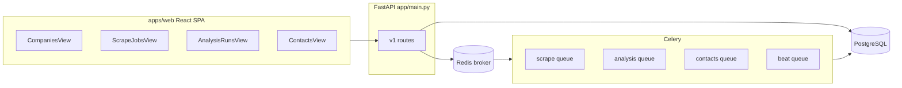

# Repository mental model: Prospect_shortlisting

## What problem it solves

Operators ingest batches of company websites (from spreadsheet uploads), **crawl** key pages (home / about / product), **classify** each company with configurable prompts and models (via OpenRouter), **review** results in a UI (thumbs, manual labels, exports), and **enrich** with prospect contacts (Snov + optional ZeroBounce). The system is built for **async scale**: long-running scrapes and LLM calls run out-of-band on Celery; state lives in **PostgreSQL** (SQLModel/Alembic).

## High-level architecture

- **Backend**: [app/main.py](../app/main.py) — FastAPI app, CORS, `/v1/health/live` and `/v1/health/ready`, routers for uploads, companies, scrape jobs/actions, runs, analysis, prompts, contacts, stats, queue admin.
- **Workers**: [app/celery_app.py](../app/celery_app.py) — Redis broker, separate queues (`scrape`, `analysis`, `contacts`, `beat`), late ack, visibility timeout tuned for long scrapes, Beat every 10m for stuck-job reconciliation.
- **Frontend**: [apps/web](../apps/web) — Vite + React; [apps/web/src/App.tsx](../apps/web/src/App.tsx) orchestrates views (companies, scrape jobs, analysis runs, operations log, analytics snapshot, contacts) and panels (markdown preview, prompts, analysis detail, company review, scrape diagnostics).
- **Config**: [app/core/config.py](../app/core/config.py) — `PS_*` env vars: DB, Redis, OpenRouter keys, Browserless CDP URL, Snov, ZeroBounce, timeouts/models.

## Core data pipeline (domain model)

Canonical schema lives in [app/models/pipeline.py](../app/models/pipeline.py):

| Stage | Tables / concepts |
|--------|-------------------|
| Ingest | `Upload` (file metadata, validation), `Company` (per URL, normalized domain, FK upload) |
| Crawl | `CrawlJob` (state machine per company), `CrawlArtifact` (fetched page URLs, HTTP status, URIs for markdown/screenshots/OCR) |
| Analyze | `Prompt`, `Run` (batch: upload + prompt + model pair + progress counters), `AnalysisJob` (per company; **lock_token** / **lock_expires_at** for idempotent workers), `ClassificationResult` (label, confidence, reasoning, **input_hash** for cache skips) |
| Human loop | `CompanyFeedback` (thumbs, comment, manual_label) |
| Contacts | `ContactFetchJob`, `ProspectContact` (Snov raw + ZeroBounce raw), `TitleMatchRule` (include/exclude keyword sets) |
| Ops | `JobEvent` (audit trail across job types) |

**Predicted labels**: `Possible`, `Crap`, `Unknown` (enum `PredictedLabel` in `app/models/pipeline.py`).

Design intent for contacts is documented in [docs/plans/2026-03-20-contact-pipeline-design.md](plans/2026-03-20-contact-pipeline-design.md) (feedback done; Snov/ZeroBounce; future email campaigns).

## Important implementation folders

- **API routes**: [app/api/routes/](../app/api/routes/) — thin HTTP layer; business logic tends to live in services.
- **Services** (orchestration): e.g. [app/services/scrape_service.py](../app/services/scrape_service.py), [app/services/analysis_service.py](../app/services/analysis_service.py), [app/services/contact_service.py](../app/services/contact_service.py), [app/services/upload_service.py](../app/services/upload_service.py), [app/services/llm_client.py](../app/services/llm_client.py), [app/services/fetch_service.py](../app/services/fetch_service.py) (static vs stealth/browserless per [docs/browserless-api-reference.md](browserless-api-reference.md)).
- **Tasks**: [app/tasks/scrape.py](../app/tasks/scrape.py), [app/tasks/analysis.py](../app/tasks/analysis.py), [app/tasks/contacts.py](../app/tasks/contacts.py), [app/tasks/beat.py](../app/tasks/beat.py).
- **Migrations**: [alembic/versions/](../alembic/versions/).
- **Tests**: [tests/](../tests/) — idempotency, Celery, beat reconciler, recovery, scrape create, markdown, etc.
- **Design notes**: [docs/plans/](plans/) — reliability, scrape throughput, operator upload, refactoring, etc.

## External dependencies (mental checklist)

- **OpenRouter** (OpenAI-compatible client) for classification and markdown-related model calls.
- **Playwright / Scrapling / curl-cffi / Browserforge** for fetching; optional **Browserless** remote Chrome.
- **Snov.io** and **ZeroBounce** for contact discovery and email status ([docs/snov-api-reference.md](snov-api-reference.md), [docs/zerobounce-api-reference.md](zerobounce-api-reference.md)).
- **Docker Compose** ([docker-compose.yml](../docker-compose.yml)) runs API + worker; Redis and DB are expected externally per [README.md](../README.md).

## How to use this model when changing code

- **New API behavior**: start at the relevant router under `app/api/routes/`, then the matching service and schema in `app/api/schemas/`.
- **Job lifecycle / retries / duplicates**: follow Celery settings in `app/celery_app.py` and DB locks on `AnalysisJob` / `ContactFetchJob`.
- **UI flows**: trace from `apps/web/src/lib/api.ts` and `types.ts` to the backend route the client calls.
- **Schema changes**: SQLModel + new Alembic revision; keep enums and `JobEvent` usage consistent if you add states.
