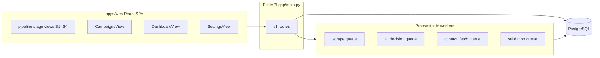

# Repository mental model: Prospect_shortlisting

> Current queue truth is `app/queue.py` plus `app/jobs/`: Procrastinate uses PostgreSQL LISTEN/NOTIFY, with no Redis broker.

## What problem it solves

Operators ingest batches of company websites (from spreadsheet uploads), **crawl** key pages (home / about / product), **classify** each company with configurable prompts and models (via OpenRouter), **review** results in a UI (thumbs, manual labels, exports), and **enrich** with prospect contacts. The system is built for **async scale**: long-running scrapes, LLM calls, contact fetching, and email validation run out-of-band on Procrastinate workers; state and queue jobs live in **PostgreSQL** (SQLModel/Alembic).

## High-level architecture

```mermaid
flowchart LR
  subgraph ui [apps/web React SPA]
    Pipeline[pipeline stage views S1–S4]
    Campaigns[CampaignsView]
    Dash[DashboardView]
    Settings[SettingsView]
  end
  subgraph api [FastAPI app/main.py]
    Routes[v1 routes]
  end
  subgraph workers [Procrastinate workers]
    scrapeQ[scrape queue]
    analysisQ[ai_decision queue]
    contactsQ[contact_fetch queue]
    validationQ[validation queue]
  end
  ui --> Routes
  Routes --> PG[(PostgreSQL)]
  Routes --> workers
  workers --> PG
```

- **Backend**: [app/main.py](../app/main.py) — FastAPI app, CORS, `/v1/health/live` and `/v1/health/ready`, routers for uploads, companies, scrape jobs/actions, analysis, prompts, contacts, stats, settings, and stage APIs.
- **Workers**: [app/queue.py](../app/queue.py) — Procrastinate app with queue-specific workers for `scrape`, `ai_decision`, `contact_fetch`, and `validation`.
- **Frontend**: [apps/web](../apps/web) — Vite + React; [apps/web/src/App.tsx](../apps/web/src/App.tsx) orchestrates pipeline stage views, full pipeline, dashboard, campaigns, uploads, settings, and auth.
- **Config**: [app/core/config.py](../app/core/config.py) — `PS_*` env vars: DB, CORS, OpenRouter keys, provider credentials, encryption key, scrape timeouts, and model settings.

## Core data pipeline (domain model)

Canonical SQLModel tables live under [app/models/](../app/models/):

| Stage | Tables / concepts |
|--------|-------------------|
| Ingest | `Campaign`, `Upload`, `UploadedDomain` in `app/models/core.py` |
| Crawl | `ScrapeBatch`, `ScrapeResult`, `ScrapeSettings` in `app/models/scrape.py` |
| Analyze | `DecisionSettings`, `ClassificationBatch`, `ClassificationResult` in `app/models/classification.py` |
| Contacts | `RoleFetchCriteria`, `EmailFetchBatch`, `VerificationBatch`, `Contact`, `FetchedPerson` in `app/models/contacts.py` |
| Settings | `IntegrationSecret` in `app/models/settings.py` |

**Predicted labels**: `possible`, `crap`, `unknown` at the API/UI boundary, displayed as `Possible`, `Crap`, `Unknown`.

## Important implementation folders

- **API routes**: [app/api/routes/](../app/api/routes/) — thin HTTP layer; business logic tends to live in services.
- **Services** (orchestration): e.g. [app/services/scrape_service.py](../app/services/scrape_service.py), [app/services/analysis_service.py](../app/services/analysis_service.py), [app/services/contact_service.py](../app/services/contact_service.py), [app/services/upload_service.py](../app/services/upload_service.py), [app/services/llm_client.py](../app/services/llm_client.py), [app/services/fetch_service.py](../app/services/fetch_service.py) (static vs stealth/browserless per [docs/browserless-api-reference.md](browserless-api-reference.md)).
- **Jobs**: [app/jobs/](../app/jobs/) — Procrastinate task definitions for scrape, AI decision, contact fetch, email fetch/reveal, validation, and health.
- **Migrations**: [alembic/versions/](../alembic/versions/).
- **Tests**: [tests/](../tests/) — idempotency, Celery, beat reconciler, recovery, scrape create, markdown, etc.

## External dependencies (mental checklist)

- **OpenRouter** (OpenAI-compatible client) for classification and markdown-related model calls.
- **Playwright / Scrapling / curl-cffi / Browserforge** for fetching; optional **Browserless** remote Chrome.
- **Snov.io** and **ZeroBounce** for contact discovery and email status ([docs/snov-api-reference.md](snov-api-reference.md), [docs/zerobounce-api-reference.md](zerobounce-api-reference.md)).
- **Docker Compose** ([docker-compose.yml](../docker-compose.yml)) runs the backend API plus queue-specific Procrastinate workers. Postgres is expected externally per [README.md](../README.md); Redis is not used.

## How to use this model when changing code

- **New API behavior**: start at the relevant router under `app/api/routes/`, then the matching service and schema in `app/api/schemas/`.
- **Job lifecycle / retries / duplicates**: follow Celery settings in `app/celery_app.py` and DB locks on `AnalysisJob` / `ContactFetchJob`.
- **UI flows**: trace from `apps/web/src/lib/api.ts` and `types.ts` to the backend route the client calls.
- **Schema changes**: SQLModel + new Alembic revision; keep enums and `JobEvent` usage consistent if you add states.
